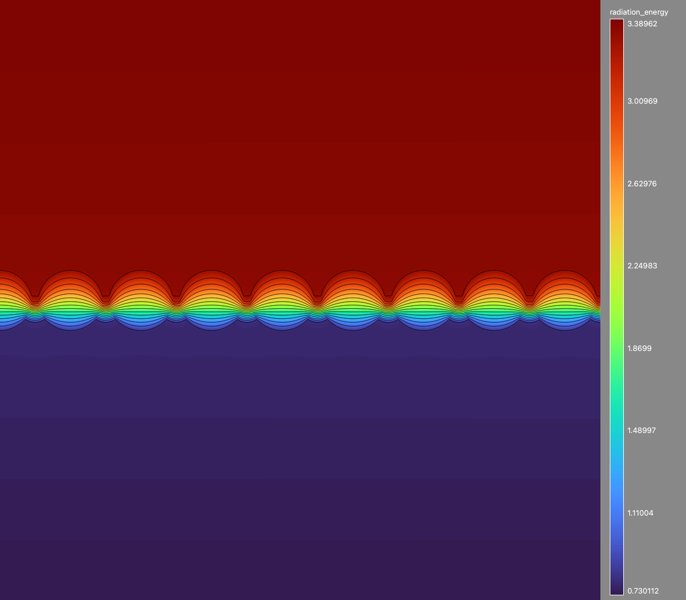

## FLD

Build:
```
git submodule update --init
gmake -j8
```

Run:
```
mpirun -np 8 ./main2d.gnu.MPI.ex cloud_fine_n=1024 cloud_only=1
```

Run the nonequilibrium radiation-diffusion test from Section 4 of
`icase-2001-12.pdf` (the paper's `dt=0.01`, 1000-step configuration):

```
mpirun -np 8 ./main2d.gnu.MPI.ex icase_only=1
```

For a short smoke test, override the resolution and step count, for example
`icase_n_cell=24 icase_steps=2 icase_write_plotfile=0`.  The default 87-by-87
Cartesian grid has 7569 cells, close to the paper's 7502-vertex triangular
mesh, and aligns the material interfaces at one-third and two-thirds of the
domain.  This implementation retains the paper's coupled nonlinear equations,
coefficients, and boundary data, but uses cell-centered finite volumes and a
block nonlinear iteration because this test driver provides scalar elliptic
solves rather than the paper's triangular finite elements and monolithic block
Jacobian.

Plot:

